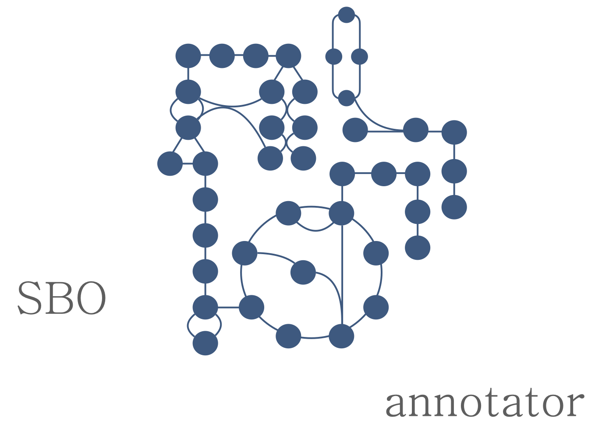

# SBOannotator

SBOannotator: A Python tool for the automated assignment of Systems Biology Ontology terms

[](http://opensource.org/licenses/LGPL-3.0)
[](https://github.com/draeger-lab/SBOannotator/releases/)


[](https://doi.org/10.5281/zenodo.7562085)

 

*Authors* : Elisabeth Fritze & [Nantia Leonidou](https://github.com/NantiaL)

### Overview

### How to cite the SBOannotator?

The online version of the SBOannotator is described in this article: 


### Installation
```
pip install sboannotator
```

### Prerequisites

This tool has the following dependencies:

python 3.8.5

Packages:
* sqlite3
* libsbml
* collections
* requests
* json

### Input data
+ `doc`: an SBML document
+ `model_libsbml`: SBML model of interest
+ `model_annotated`: True, if model already includes annotations with EC numbers
+ `database_name`: name of imported database, without extension
+ `new_filename`: file name for output model


### Outputs
+ `model_libsbml`: Annotated libsbml model
  

### Usage
To run SBOannotator use the `main.py` script and modify the parameters in the `readSBML` and `sbo_annotator` 
functions as wished.

If ERROR occurs, check the current version of Python: 

- `python --version'`
- `conda install python=3.8`


