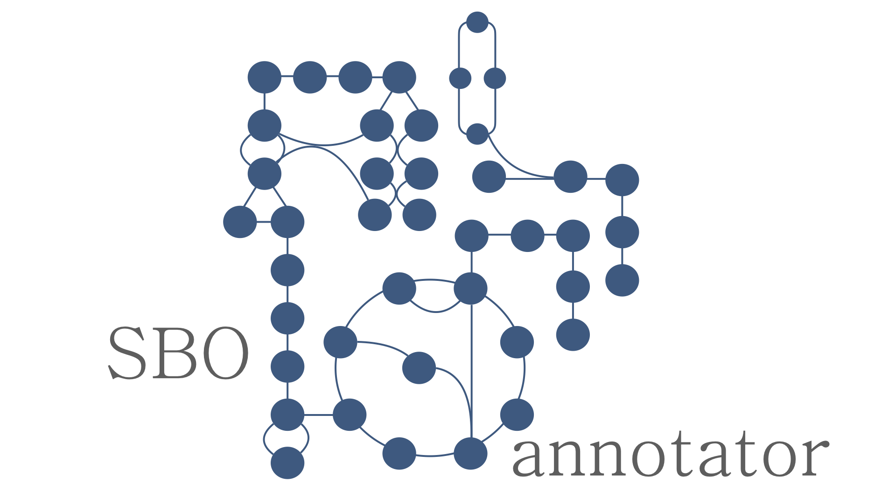

# SBOannotator


**SBOannotator: a Python tool for the automated assignment of Systems Biology Ontology terms**

[](http://opensource.org/licenses/LGPL-3.0)
[](https://github.com/draeger-lab/SBOannotator/releases/)

[](https://badge.fury.io/py/SBOannotator)

[](https://pypistats.org/packages/SBOannotator)
[](https://doi.org/10.1093/bioinformatics/btad437)

Developers : [Nantia Leonidou](https://github.com/NantiaL) & Elisabeth Fritze& Jiahui Hu
___________________________________________________________________________________________________________


### Overview
This project transforms SBOannotator from a static, hard-coded tool into a dynamic, intelligent system for annotating Systems Biology Ontology (SBO) terms in SBML models. The enhanced system integrates real-time SBO term retrieval, multiple enzymology data sources, and LLM-assisted annotation—significantly improving accuracy and usability while preserving the core rule-based strengths. A standalone desktop GUI with interactive visualization makes powerful annotation capabilities accessible to a broader community of systems biology researchers.
The system delivers three key innovations:
- Automated GitHub integration for real-time SBO file updates;
- A three-layer rule-based annotation workflow based on 4 database(bigg, kegg, reactome, seed);
- A finetuned LLM achieving 94% accuracy to predict SBO terms within 42 candidates for EC number .

### Input data
+ an SBML document
+ a sbo terms (.json or obo)(optional)


### Outputs
+ Rule Based Enhanced Annotated libSBML model
+ LLM Annototed libSBML model
+ Uptodate SBO terms (.json) 

### Usage with terminal
This tool has the following dependencies:

**Python** >= 3.9.6

**Packages:**
- sqlite3
- libsbml
- collections
- requests
- json
- time

**Trained Model (423MB):**
- Download pretrained model: https://drive.google.com/file/d/1Kypb5YmLKUbFY9tZuzk0p1Mn_FWaD0g_/view?usp=drive_link
- Place the downloaded file at: `src/ml_sbo/models/stage1_80_stage2_10/pytorch_model.bin`

**Run**
- `pip install -r requirements.txt`
- `python main.py` in the command line within the project folder. If ERROR occurs, check the current version of Python: 

- `python --version`
- `conda install python>=3.9.6`


### Desktop App

1. macOS: Download the DMG  
  https://drive.google.com/file/d/1Ltm2nsFXpuVh7wgmQAY9Jg67EPJEooHW/view?usp=drive_link

2. Open the `.dmg`, then drag the app into **Applications**.
3. First launch: if Gatekeeper blocks the app, remove the quarantine attribute in Terminal:
   ```bash
   sudo xattr -r -d com.apple.quarantine "/Applications/main.app"

### Exemplary models and results
The folder `models/Customer_Models` contains a  models as it were downloaded from
the BiGG database. 
The annotated models after using the Rule based SBOannotator and target reaction filtered for llm are listed in the folder named `models/Enhanced_Annotated_Models`.
The annotated models after using the LLM recommendationi are listed in the models/LLM_Annotated_Models